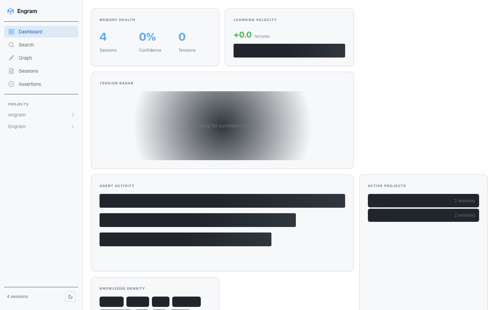

# Engram

<p align="center">
  <a href="LICENSE"></a>
  
  
  
  <a href="https://github.com/tinydarkforge/Engram/actions/workflows/ci.yml"></a>
  <a href="https://www.npmjs.com/package/@tinydarkforge/engram"></a>
</p>

<p align="center">
  
</p>

**Engram** is an **epistemic engine** for AI coding agents — not just memory. It persists facts with confidence, corroboration, and contradiction tracking across repositories, autonomously learns from outcomes, exposes everything over MCP, and replaces itself in your context window on a token budget.

> **Epistemic engine** = contradiction detection + confidence-ranked retrieval + autonomous fact lifecycle + token-budgeted injection. Engram doesn't just store what you said — it tracks what's true, what conflicts, and what's worth remembering.

---

## Quick start

```bash
npm install -g @tinydarkforge/engram
engram setup
claude mcp add engram -s user -- engram mcp
```

Engram is now available as a tool in every Claude Code session. It remembers what you did across every repository, ranks what it knows, and injects a budget-capped slice of context on demand.

---

## How it works

Engram captures engineering work and stores it in two layers:

**Session memory** — Git-hook or manual `engram remember` saves notes, topics, diffs, and test deltas to a per-project index. Every repo on your machine gets its own namespace.

**Assertion ledger** — A SQLite-backed fact store. Every claim records confidence (`0.0–1.0`), status (`tentative → established → fossilized`), quorum count, decay model, lineage, and tension markers.

**Autonomous Intelligence** — Engram runs a background learning loop during consolidation. It automatically detects contradictions (tensions), promotes corroborated facts to established status, and fossilizes outdated knowledge without user intervention.

### Retrieval

Queries traverse four layers, stopping at the earliest one that answers:

| Layer | Size | Latency | Role |
|-------|------|---------|------|
| Bloom filter | 243 B | ~0.1 ms | Instant *"not known"* — zero tokens consumed |
| Session index | ~4 KB | ~10 ms | Compact summaries — answers ~80% of queries |
| Session detail | per-file | ~5 ms | Full content, lazy-loaded on demand |
| Ledger | ~2 KB/fact | 5–15 ms | Ranked facts with confidence, quorum, tension |

Results are packed into a caller-specified token budget using `decay × status × quorum × tension × weight`.

**Semantic search** uses a local ONNX embedding model (`@huggingface/transformers`) that loads lazily on the first semantic query. Text search and keyword recall work without it.

---

## Install

### Global (recommended)

```bash
npm install -g @tinydarkforge/engram
engram setup
```

### From source

```bash
git clone https://github.com/tinydarkforge/Engram.git
cd Engram
npm install
npm run setup
```

### Connect Claude Code

```bash
# Global install
claude mcp add engram -s user -- engram mcp

# Source install  
claude mcp add engram -s user -- node "$(pwd)/scripts/mcp-server.mjs"
```

---

## Usage

```bash
# Save a session
engram remember "Implemented OAuth callback handling" --topics auth,oauth

# Interactive session capture
engram remember --interactive

# Search across all projects
engram semantic "authentication work"
engram search "oauth"

# One-shot query against the assertion ledger
engram ask "what do we know about authentication"   # new in v5

# Temporal compaction — fossilize low-signal assertions
engram compact   # new in v5

# View status and ledger health
engram status

# Launch the web dashboard
engram start   # → http://127.0.0.1:3000
```

### Dashboard API

The dashboard exposes live metrics endpoints:

| Endpoint | Returns |
|---|---|
| `GET /api/stats` | Session counts, projects, topic count |
| `GET /api/dashboard/tensions` | Unresolved contradictions with claims |
| `GET /api/dashboard/velocity` | Facts/day rate + 30-day sparkline data |
| `GET /api/dashboard/consolidation` | Last consolidation run time and tasks |
| `GET /api/assertions` | Paginated assertion browser |
| `GET /api/assertions/:id` | Full detail with outcomes, lineage, feedback |

### Background consolidation

Engram runs periodic consolidation (every 5 min) to close the learning loop:

```
ledger_scan    →  Detect new contradictions (tensions)
ledger_verify  →  Re-verify stale state_bound facts
counterfactual →  Recompute importance weights
post_hoc       →  Score assertion outcomes from sessions
auto_resolve   →  Auto-resolve tensions older than 30 days
ledger_transform → Promote/fossilize/weight assertions
```

Run a full cycle manually:
```bash
npm run consolidate:full   # --all including manifest + embeddings
node scripts/consolidate.js --all
```

### MCP tools (available in Claude Code, OpenCode, Cursor, Aider, and Windsurf)

Engram exposes tools via MCP for session search, ledger ingestion, context selection, semantic recall, cross-project search, and agent handoff. Run `engram mcp` to start the MCP server, or configure any agent:

```bash
engram setup --agent claude       # Claude Code
engram setup --agent opencode     # OpenCode CLI
engram setup --agent cursor       # Cursor IDE
engram setup --agent aider        # Aider
engram setup --agent windsurf     # Windsurf
```

---

## Features

| | Engram | Gentleman-Programming/engram (Go) | mem0 | Letta / Zep |
|---|---|---|---|---|
| Local-first (no cloud) | Yes | Yes | No | No |
| **Contradiction detection + auto-resolve** | **Yes** | No | No | No |
| **Confidence-ranked retrieval** | **Yes** | No | No | No |
| **Assertion ledger** (confidence, quorum, status) | **Yes** | No | No | No |
| **Autonomous consolidation (learning loop)** | **Yes** | No | No | No |
| **Post-hoc outcome scoring** | **Yes** | No | No | No |
| **Counterfactual importance weighting** | **Yes** | No | No | No |
| **Semantic recall** (by meaning, not keyword) | **Yes** | No | No | Yes |
| **Temporal compaction** (fossilize low-signal) | **Yes** | No | No | No |
| **Event-driven confidence adjustment** | **Yes** | No | No | No |
| MCP-native (7+ agents) | Yes | No | No | No |
| Git-hook session capture | Yes | Yes | Partial | Partial |
| Token-budgeted retrieval | Yes | Yes | No | No |
| Semantic search (local ONNX) | Yes | No | Yes | Yes |
| Cross-session diff | Yes | No | No | No |
| Agent handoff | Yes | No | Limited | Limited |
| MCP Resources with subscriptions | Yes | No | No | No |
| Live dashboard (tension radar, velocity, etc.) | Yes | No | No | No |

---

## Prerequisites

- **Node.js** `>=20`
- **macOS** or **Linux** (Windows not supported — shell scripts and symlinks)
- **Semantic search** downloads a ~100 MB ONNX embedding model on first query. Keyword search works without it.

---

## Security

- **No network calls** unless you opt in. The embedding model is downloaded once and cached locally. If you never invoke semantic search, nothing is fetched.
- **No telemetry.** Engram never phones home.
- **Local files only.** Session data lives under `~/.engram/summaries/` and the ledger DB in `~/.engram/.cache/engram.db`.
- Reporting vulnerabilities: see [SECURITY.md](SECURITY.md).

---

## Architecture

```
scripts/     Runtime, CLI, MCP servers, ledger, consolidation
web/         Dashboard UI (Express + static files)
tests/       29 test files (node:test)
schemas/     JSON schemas for sessions and ledger
migrations/  SQLite schema migrations
examples/    Curated session records
```

Engram runs two servers:
- **HTTP API + Dashboard** (port 3000) — REST endpoints and web UI
- **MCP server** (port 3001) — Streamable HTTP and stdio transports for Claude Code

Both can run simultaneously. The MCP server accepts optional API key authentication.

---

## License

MIT — see [LICENSE](LICENSE).

---

<p align="center"><a href="https://github.com/tinydarkforge/Engram">GitHub</a> · <a href="mailto:hello@tinydarkforge.com">Contact</a></p>
